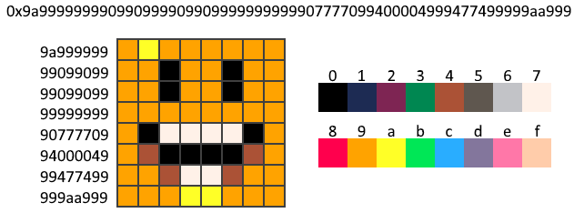

# PixelCons-Contracts
These are the flattened versions of the PixelCons contracts that were used during deployment. The full contract code can still be found in the main **PixelCons-Core** project [here](https://github.com/PixelCons/PixelCons-Core)

#### Ethereum Mainnet (Solidity v0.4.24):
- PixelCons: [0x5536B6aAdd29eAf0DB112Bb28046A5FaD3761bD4](https://etherscan.io/address/0x5536b6aadd29eaf0db112bb28046a5fad3761bd4)

## PixelCons Contract
The purpose of this contract is to provide a shared ecosystem of minimal pixel art tokens for everyone to use. All users are treated 
equally with the exception of an admin user who only controls the ERC721 metadata function which points to the app website. No fees are 
required to interact with this contract beyond base gas fees. 

#### PixelCons [The core ERC721 token of this contract]
- Each PixelCon is unique with an ID that encodes all its pixel data

- PixelCons can be identified by both TokenIDs and TokenIndexes which requires fewer bits to store (64bits)
- Small metadata is stored alongside a PixelCon to keep track of the creator, created date, an 8byte name, and collection index (if applicable)
- A PixelCon name can be changed by the creator as long as they are currently the owner
- New PixelCons can be created by anyone as long as it does not already exist
- A PixelCon can never be destroyed
- Total number of PixelCons is limited to 18,446,744,073,709,551,616 (2^64)
- A single account can only hold 4,294,967,296 PixelCons (2^32)

#### Collections [Grouping mechanism for associating PixelCons together]
- Each collection contains two or more PixelCons and can be given an 8byte name
- A Collection name can be changed by the creator as long as they are currently the owner of all its PixelCons
- Collections are identified by an index (zero is invalid)
- Collections can only be created by a user who both created and currently owns all its PixelCons
- A PixelCon can only belong to one collection
- Collections can be cleared, which will free up the PixelCons inside it and blank out its name
- Total number of collections is limited to 18,446,744,073,709,551,616 (2^64)
